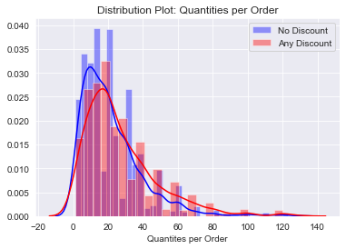
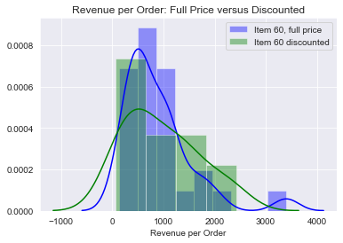
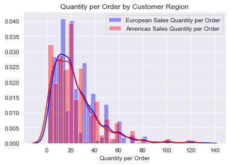
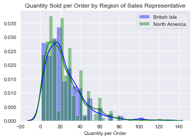

# Module 3 (V2) - Final Project

## Hypothesis Testing Within the Northwind Database

## Objectives

Gather and perform statistical analysis on data from the Northwind database, a database created by Microsoft which contains operational data for a fictional speciality groceries provider. 

The following questions will be explored using statitistical analysis:

    1. Do discounts have a statistically significant effect on the quantity of a product sold? And if so, at what levels of discount?
    2. Is there a statistically significant increase in revenue for discounted items?
    3. Does the region of Northwind customers have a statistically significant effect on quantities ordered?
    4. Does the region of the Northwind sales representatives have a statistically significant effect on quantities ordered?
    

## Method

A SQL query is made into the database to extract the information needed to answer each question listed above. Once the query is made, the data is organized into a dataframe using pandas, and any further manipulation of the data is completed. The final data series is converted into arrays using numpy, and the arrays are plotted and tested for normality using seaborn distribution plots and scipy.stats.normaltest(). If the original distributions are not normal, then the central limit theorem is utilized, and a distribution of samples means are generated, plotted and tested for normality using a series of three functions created within the notebook: get_sample(), get_sample_mean() and create_sample_distribution(). If the distibution now passes the test for normality, then a series of functions are run on the two distibutions to calculate the welch's t-statistic, the effective degrees of freedom, the p-value and the Cohen's d value. All of these functions were also created within the notebook: welch_t(), welch_df(), p_value() and cohens_d(). These functions give all the data necessary to either accept or reject each null hypothesis, as listed below.

 
    
## Findings

### null hypothesis: 
There is not a significant increase in quantities sold when items are discounted.
### alternative hypothesis:
There is a significant increase in quantities sold when items are discounted.
### result:
There is enough evidence to reject the null hypothesis given an alpha of 0.05 for discounts of 5%, 10%, 15%, 20% and 25%

### null hypothesis: 
There is not a significant difference in sales revenue per item when discounted.
### alternative hypothesis:
There is a significant difference in sales revenue per item when discounted. 
### result:
There is not enough evidence to reject the null hypothesis given an alpha of 0.05.

### null hypothesis: 
The region of the customer has no significant effect on quantities per order.
### alternative hypothesis:
The region of the customer has a significant effect on quantities per order.
### result:
There is not enough evidence to reject the null hypothesis given an alpha of 0.05.

### null hypothesis: 
The region of the sales representative has no significant effect on quantities per order.
### alternative hypothesis:
The region of the sales representative has a significant effect on quantities per order.
### result:
There is not enough evidence to reject the null hypothesis given an alpha of 0.05.

## Table of Contents

[Jupyter_Notebook](Module3Project.ipynb)

[Northwind_ERD](Northwind_ERD.png)

[Summary_Slides](Module3SummarySlides.pdf)

[Blog_Post](https://medium.com/@stacyshingleton/hypothesis-testing-within-the-northwind-database-50d744c1640e)

